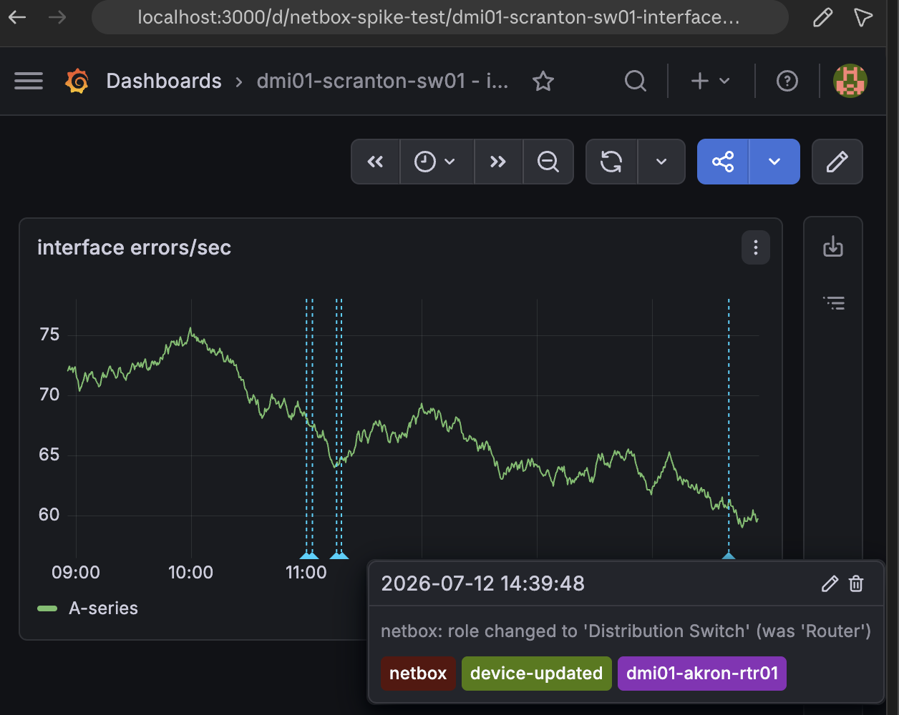
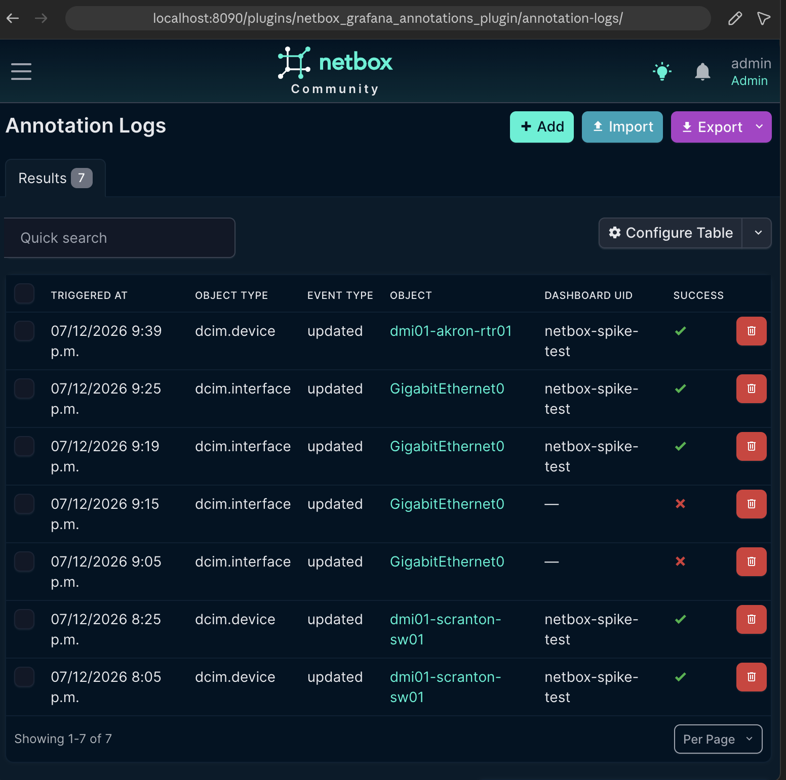
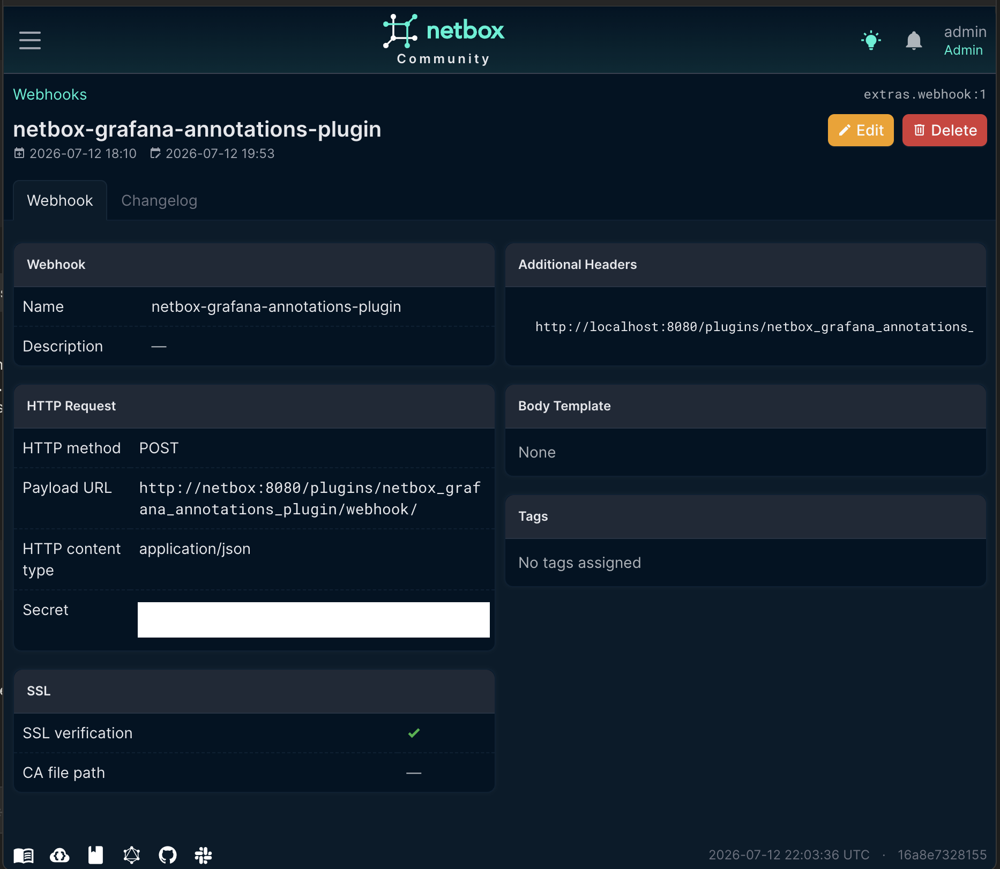
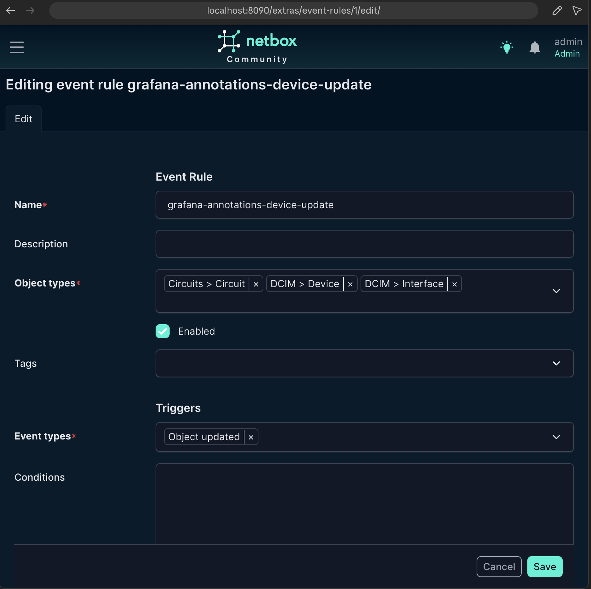

# NetBox Grafana Annotations Plugin

**See the moment a NetBox change happened, right on the Grafana graph it affected.**

When someone edits a device, changes its role, or flips a status in NetBox, this plugin drops a marker onto the matching Grafana dashboard at that exact timestamp — so "did something change in NetBox around when this started?" is answered by glancing at the graph, not by cross-referencing two tools by hand.

* Free software: Apache-2.0
* Documentation: https://mfarook2.github.io/netbox-grafana-annotations-plugin/

## Why this exists

NetBox is source of truth for what's *supposed* to be true about your network. Grafana is where people actually watch it behave. Today those two are disconnected: an engineer re-roles a device or flips a status at 2:14pm, and there is no marker anywhere showing that. Debugging "why did errors spike around 2pm" means manually opening NetBox's changelog and eyeballing timestamps against a graph.

This plugin closes that gap automatically:

1. You edit an object in NetBox (a device role change, a status flip, whatever your Event Rule is scoped to).
2. NetBox's own Event Rule / Webhook system — no custom signal handling — fires a POST at this plugin.
3. The plugin resolves which Grafana dashboard/panel that object maps to, and posts an annotation via Grafana's own Annotations API.
4. The marker is already sitting on the graph, before anyone thinks to look for it — whether they're investigating an incident that started hours ago, or just watching the graph for a few minutes right after making the change to confirm nothing broke.

## Screenshots

**The annotation, on the graph, in Grafana:**



*Capture from your Grafana dashboard: hover the dashed vertical marker so the tooltip (timestamp, text, tags) is visible, then screenshot the panel.*

**The plugin's own Annotation Logs list, inside NetBox:**



*Capture from `http://<your-netbox>/plugins/netbox_grafana_annotations_plugin/annotation-logs/` after at least one event has fired.*

**Configuring the NetBox Webhook that points at this plugin:**



*Capture from a Webhook's edit page in NetBox (Operations → Webhooks) with the Payload URL and Secret fields visible.*

**Configuring the Event Rule that triggers it:**



*Capture from an Event Rule's edit page in NetBox (Operations → Event Rules), showing the object type, trigger, and the Webhook selected as its action.*

## How it works (architecture)

```
NetBox object changes
      │
      ▼
NetBox Event Rule (built-in) ──POST──▶ this plugin's webhook endpoint
                                          /plugins/netbox_grafana_annotations_plugin/webhook/
                                              │
                                              ▼
                                   Verify X-Hook-Signature (HMAC-SHA512,
                                   NetBox's own webhook-signing convention)
                                              │
                                              ▼
                                   Parse payload: object type, event type,
                                   changed fields, timestamp
                                              │
                                              ▼
                                   Resolve target Grafana dashboard/panel:
                                     1. grafana_dashboard_uid custom field
                                        on the object, if set (override)
                                     2. else, live Grafana tag search:
                                        GET /api/search?tag=netbox:{type}:{name}
                                              │
                                              ▼
                                   POST /api/annotations (Grafana)
                                              │
                                              ▼
                                   Log the attempt to this plugin's own
                                   Annotation Logs (success/failure, visible
                                   in the NetBox UI)
```

The plugin intentionally rides on NetBox's native Event Rule / Webhook system rather than hooking Django signals — it's the documented, upgrade-safe extension point, and it's what NetBox admins already know how to configure.

**Known limitation, stated plainly:** the trigger is a NetBox database change, not a confirmed device deployment. NetBox doesn't push config to devices itself, so a marker means "this was recorded in NetBox at this time," not "the device's behavior changed at this time." For teams that deploy close-in-time to NetBox edits, that gap is usually minutes, not weeks — but don't market this as "shows exactly when the device changed."

## Compatibility

This plugin requires **NetBox 4.6** or later. Confirmed by manual testing against NetBox v4.6.4.

| NetBox Version | Plugin Version |
|----------------|----------------|
|     4.6.x      |      0.1.0     |

See [COMPATIBILITY.md](COMPATIBILITY.md) for the full matrix and upgrade notes.

## Dependencies

- NetBox 4.6 or later
- Python 3.12 or later
- [`requests`](https://pypi.org/project/requests/) (installed automatically as a plugin dependency)
- A Grafana instance reachable from your NetBox server, with an API token (Bearer auth) that can create annotations and search dashboards

No other services are required — no message queue, no external database, nothing beyond NetBox + Grafana.

## Installing

While this is still in development and not yet on PyPI, install with pip:

```bash
pip install git+https://github.com/mfarook2/netbox-grafana-annotations-plugin
```

or by adding to your `local_requirements.txt` / `plugin_requirements.txt` (netbox-docker):

```
git+https://github.com/mfarook2/netbox-grafana-annotations-plugin
```

For netbox-docker specifically, see [the general instructions for using netbox-docker with plugins](https://github.com/netbox-community/netbox-docker/wiki/Using-Netbox-Plugins).

## Configuration

Enable the plugin and configure it in NetBox's `configuration.py` (or netbox-docker's `configuration/plugins.py`):

```python
PLUGINS = [
    "netbox_grafana_annotations_plugin",
]

PLUGINS_CONFIG = {
    "netbox_grafana_annotations_plugin": {
        "grafana_url": "https://grafana.example.com",
        "grafana_token": "<Grafana API token, Bearer auth>",
        "webhook_secret": "<a random string — must match the Secret on your NetBox Webhook>",

        # Optional, shown with their defaults:
        "tag_template": "netbox:{object_type}:{object_name}",
        "dashboard_uid_field": "grafana_dashboard_uid",
        "panel_id_field": "grafana_panel_id",
        "default_tags": ["netbox"],
        "timeout": 5,
        "cache_ttl": 60,
    },
}
```

| Setting | Required | Default | What it does |
|---|---|---|---|
| `grafana_url` | Yes | — | Base URL of your Grafana instance, no trailing slash. |
| `grafana_token` | Yes | — | A Grafana API token (service-account token recommended) sent as `Authorization: Bearer <token>`. Needs permission to search dashboards and create annotations. |
| `webhook_secret` | Strongly recommended | `""` | Shared secret used to verify the `X-Hook-Signature` header NetBox sends. Must exactly match the Secret field on the NetBox Webhook object. **If left blank, the endpoint accepts unsigned requests from anyone who can reach it — fine for a local dev instance, not for anything else.** |
| `tag_template` | No | `"netbox:{object_type}:{object_name}"` | Format string used to search Grafana for a matching dashboard when no custom-field override is set. `{object_type}` is e.g. `dcim.device`; `{object_name}` is the object's display name. |
| `dashboard_uid_field` | No | `"grafana_dashboard_uid"` | Name of the NetBox custom field (if you create one) that overrides the tag-search mapping for a specific object. |
| `panel_id_field` | No | `"grafana_panel_id"` | Companion custom field for pinning a specific panel ID alongside the dashboard override. |
| `default_tags` | No | `["netbox"]` | Tags always included on every annotation, in addition to `device-{event}` and the object's name. |
| `timeout` | No | `5` | Seconds to wait on each Grafana HTTP call before giving up. |
| `cache_ttl` | No | `60` | Seconds to cache a tag-search result (including "nothing found") so a burst of edits to the same object doesn't re-search Grafana every time. |

## Which NetBox object types should I cover?

Not every object type is worth annotating — the useful signal comes from objects that map to something you'd actually put a Grafana panel next to. Recommended core set, all supported today:

- **Device** — role/status/platform changes, one dashboard per device.
- **Interface** — enabled/disabled, description, mode, speed changes. Often the most valuable one, since a lot of real dashboards are per-interface.
- **Circuit** — status/provider changes, for WAN/circuit-utilization dashboards.

Leave out catalog/administrative objects (Device Type, Manufacturer, Device Role *definitions*, Tenant, Site metadata) — editing those doesn't correlate with anything happening on a graph, it's just noise.

**Device and Circuit are "top-level" objects** — each has its own name and its own dashboard, so the mapping logic (below) works against the object's own identity directly.

**Interface is a "child" object** — an interface doesn't have its own dashboard (there's no such thing as a "per-interface Grafana dashboard"); the dashboard that matters is its *parent device's*. The plugin knows this and automatically resolves an Interface event to its parent device for mapping purposes, while still recording the interface as the object that actually changed in Annotation Logs, and mentioning it by name in the annotation text/tags (e.g. `"netbox: GigabitEthernet0 — description changed to '...' (was '...')"`, tagged with both the device's and the interface's names). This is implemented via `parsing.PARENT_OBJECT_MAP`, a small config dict — extend it if you add other child object types (e.g. Cable) to your Event Rule.

## Setup workflow (step by step)

This is the full path from "plugin installed" to "seeing a real annotation." It assumes you already have NetBox and Grafana running somewhere reachable from each other.

1. **Install and configure the plugin** — see Installing/Configuration above. Run `python manage.py migrate` afterward so the `AnnotationLog` table gets created.

2. **Create a Grafana API token.** In Grafana: **Administration → Users and access → Service accounts → Add service account** (Editor role is enough) → **Add service account token**. Put the token in `grafana_token`.

3. **Pick a shared secret** for `webhook_secret` — any random string (e.g. `openssl rand -hex 32`). You'll enter this same value into NetBox in step 5.

4. **Decide how objects map to dashboards** — pick one, both can coexist:

   - **Tag your Grafana dashboards** with `netbox:{object_type}:{object_name}` (e.g. `netbox:dcim.device:dmi01-scranton-sw01`) — the default/primary path, no NetBox-side data entry needed. To add a tag to an existing dashboard: open it → **Edit** (pencil icon, top right) → open the dashboard's JSON editor (in Grafana 13.x this is the **`{}`** icon in the right-hand icon rail, labeled **"Edit as code"**; older Grafana versions expose the same thing as **Settings → JSON Model**) → add the tag string to the top-level `"tags"` array → **Apply changes** → **Save** (the dashboard's own Save button, not just the JSON editor's). (Some Grafana versions also expose a plain "Tags" field under Settings → General — use whichever your version shows; the JSON/code editor always works regardless of version.)
   - **Or add a NetBox custom field** for a specific-object override: **Customization → Custom Fields → Add** → **Object types**: select the type(s) you want (e.g. `DCIM > Device`) → **Name**: `grafana_dashboard_uid` → **Type**: Text → **Create**. Then, on any object of that type, fill in the field (found under a "Custom Fields" section on its edit page) with the target dashboard's UID. This always wins over the tag search when set — use it for objects that need a pinned panel, or whose dashboard can't be tagged. (Optional: add a second custom field named `grafana_panel_id`, type Integer, to also pin a specific panel.)

5. **Create a Webhook in NetBox** (Operations → Webhooks → Add):
   - **Name**: anything descriptive (e.g. `grafana-annotations`)
   - **URL** (labeled "Payload URL" in some NetBox versions): `http(s)://<your-netbox-host>/plugins/netbox_grafana_annotations_plugin/webhook/`
   - **HTTP method**: POST, **HTTP content type**: `application/json`
   - **Secret**: the same string as `webhook_secret` from step 3

   > If NetBox's webhook-delivery worker runs in a different container/host than the web process (true for the default netbox-docker layout, where `netbox-worker` is separate from `netbox`), `localhost` in this URL will **not** reach the web process. Use the actual reachable hostname — the Docker Compose service name (`http://netbox:8080/...`) if both are on the same Compose network, or the container's real address otherwise.

6. **Create an Event Rule in NetBox** (Operations → Event Rules → Add):
   - **Object types**: a multi-select field — type to search, click a match to add it, repeat. Add all the object types you want covered in one rule (e.g. `DCIM > Device`, `DCIM > Interface`, `Circuits > Circuit` — see "Which NetBox object types should I cover?" above).
   - **Event types** (i.e. which operations trigger it) — another multi-select: **Object created**, **Object updated**, **Object deleted**. Check whichever apply; "Object updated" alone is a reasonable starting point.
   - **Enabled**: checked.
   - Scroll down to **Action type**: `Webhook`, then **Webhook**: select the one you created in step 5.
   - **Save**.

7. **Make a real change** to an object matching that Event Rule (e.g. edit a device's role, or an interface's description). Within a few seconds:
   - Check `/plugins/netbox_grafana_annotations_plugin/annotation-logs/` in NetBox — you should see a new entry with `success = Yes`.
   - Check the matching Grafana dashboard — the annotation marker should be there.

If either doesn't show up, see Troubleshooting below.

**All of the above has been verified end-to-end against a real NetBox v4.6.4 + Grafana 13.0.2 instance** — both mapping paths (tag search and custom-field override), both object shapes (top-level Device and child-object Interface via parent resolution), and Circuit as a second top-level type.

## Troubleshooting

| Symptom | Likely cause |
|---|---|
| NetBox shows the webhook delivery failed with a connection error | The Payload URL isn't reachable from wherever NetBox's webhook worker actually runs — see the networking note in step 5 above. |
| Annotation Logs entry has `success = No`, error mentions signature/403 | `webhook_secret` in `PLUGINS_CONFIG` doesn't match the Secret on the NetBox Webhook object — they must be identical strings. |
| Annotation Logs entry has `success = No`, error is `no Grafana dashboard mapping found` | Neither the custom field nor a matching Grafana tag was found for that object — see step 4. |
| Annotation Logs entry has `success = No`, error mentions connection refused / timeout | `grafana_url` isn't reachable from NetBox's server process, or `grafana_token` is invalid/expired. |
| Nothing shows up in Annotation Logs at all | The webhook never reached the plugin — double check the Event Rule is enabled and actually scoped to the object type/event you're testing, and that the Webhook's Payload URL is exactly right (including the trailing slash). |

## Viewing what happened

Every webhook the plugin receives — successful or not — is recorded under **Annotation Logs** in NetBox's plugin navigation, with the resolved dashboard/panel, the exact annotation text sent, Grafana's HTTP response status, and an error detail field for failures. Nothing fails silently.

## Development / running the tests

```bash
git clone https://github.com/mfarook2/netbox-grafana-annotations-plugin
cd netbox-grafana-annotations-plugin
pip install -e .[test]
```

Tests run against a real NetBox instance (they exercise real Django models, migrations, and views — no live Grafana instance required, Grafana calls are mocked):

```bash
python manage.py test netbox_grafana_annotations_plugin.tests
```

See [TESTING.md](TESTING.md) for the full local test setup and [.github/workflows/ci.yaml](.github/workflows/ci.yaml) for how CI runs it against a fresh NetBox checkout.

## Contributing

Contributions are welcome! Please see [CONTRIBUTING.md](CONTRIBUTING.md) for guidelines.

### Reporting Bugs

Please report bugs by opening an issue on our [GitHub Issues](https://github.com/mfarook2/netbox-grafana-annotations-plugin/issues) page. When reporting bugs, please include:

- NetBox version
- Plugin version
- Python version
- Steps to reproduce
- Expected behavior
- Actual behavior

### Feature Requests

Feature requests can be submitted as [GitHub Issues](https://github.com/mfarook2/netbox-grafana-annotations-plugin/issues) with the "enhancement" label.

## Support

- **Documentation**: https://mfarook2.github.io/netbox-grafana-annotations-plugin/
- **Issues**: https://github.com/mfarook2/netbox-grafana-annotations-plugin/issues
- **Discussions**: https://github.com/mfarook2/netbox-grafana-annotations-plugin/discussions
- **NetBox Community Slack**: [netdev-community.slack.com](https://netdev.chat/)

## Credits

Based on the NetBox plugin tutorial:

- [demo repository](https://github.com/netbox-community/netbox-plugin-demo)
- [tutorial](https://github.com/netbox-community/netbox-plugin-tutorial)

This package was created with [Cookiecutter](https://github.com/audreyr/cookiecutter) and the [`netbox-community/cookiecutter-netbox-plugin`](https://github.com/netbox-community/cookiecutter-netbox-plugin) project template.
